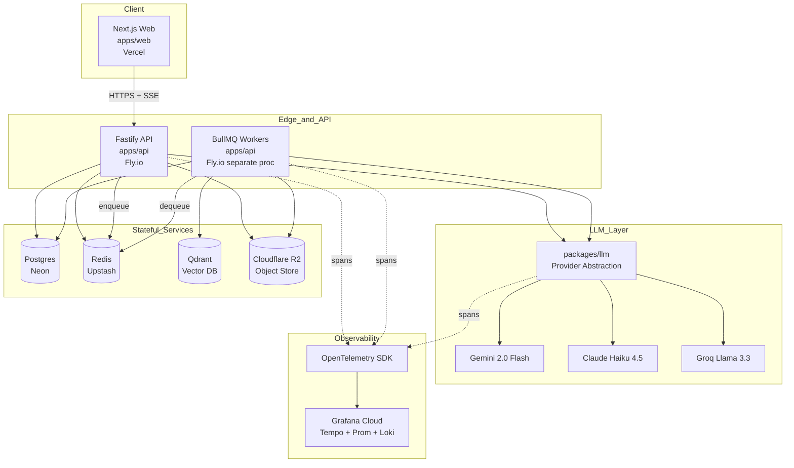
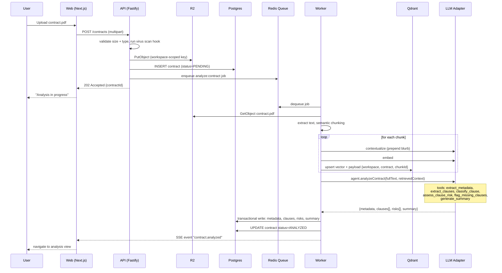
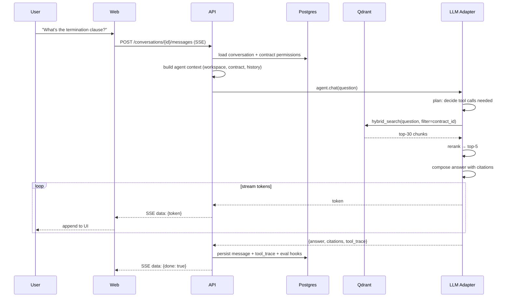
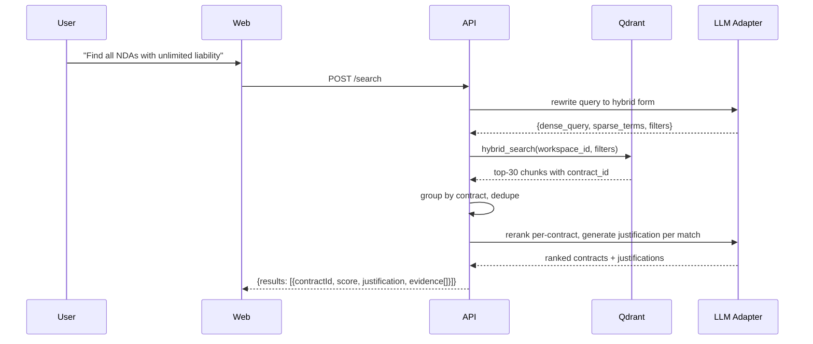
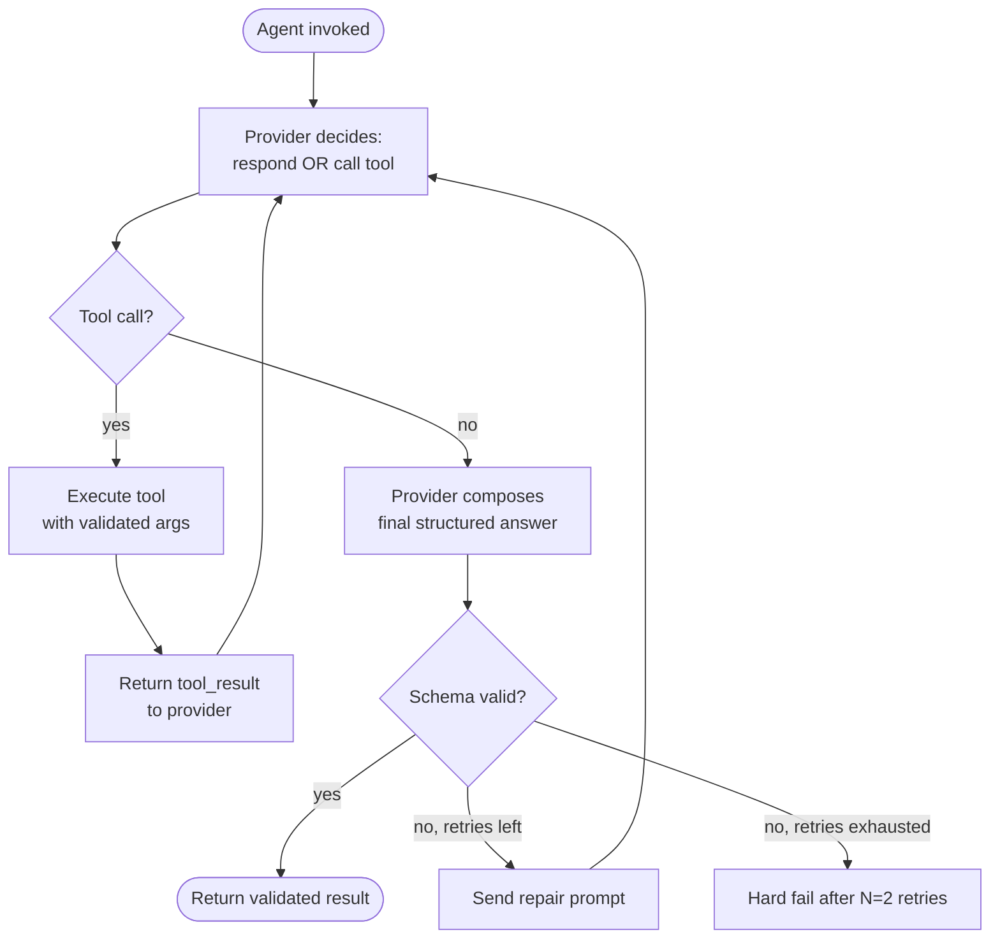
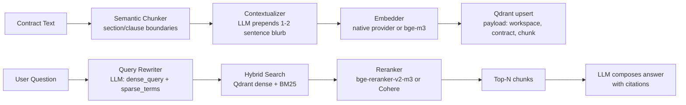
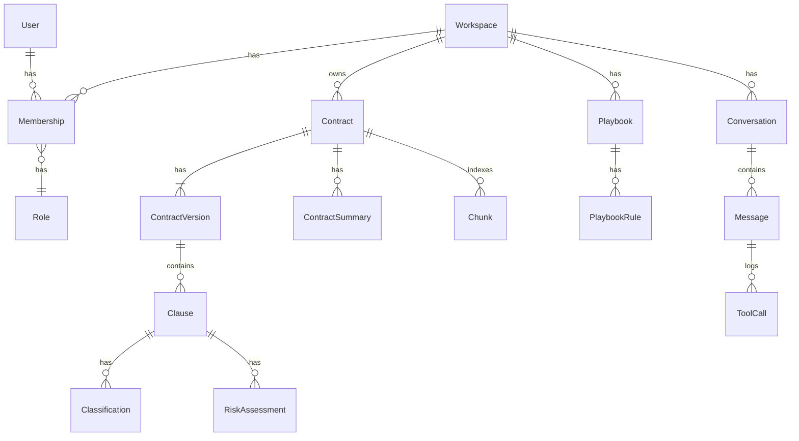
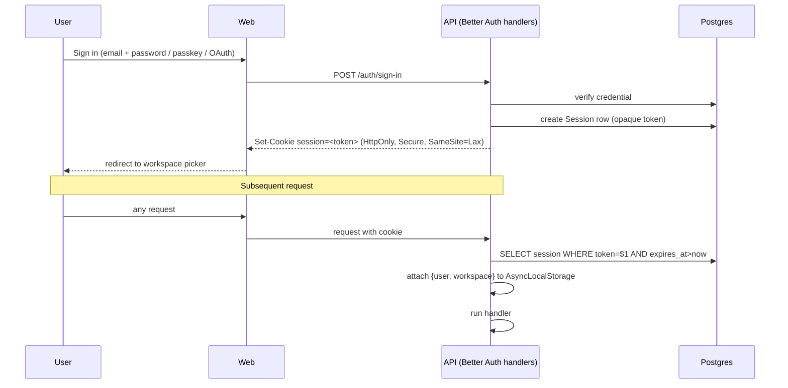
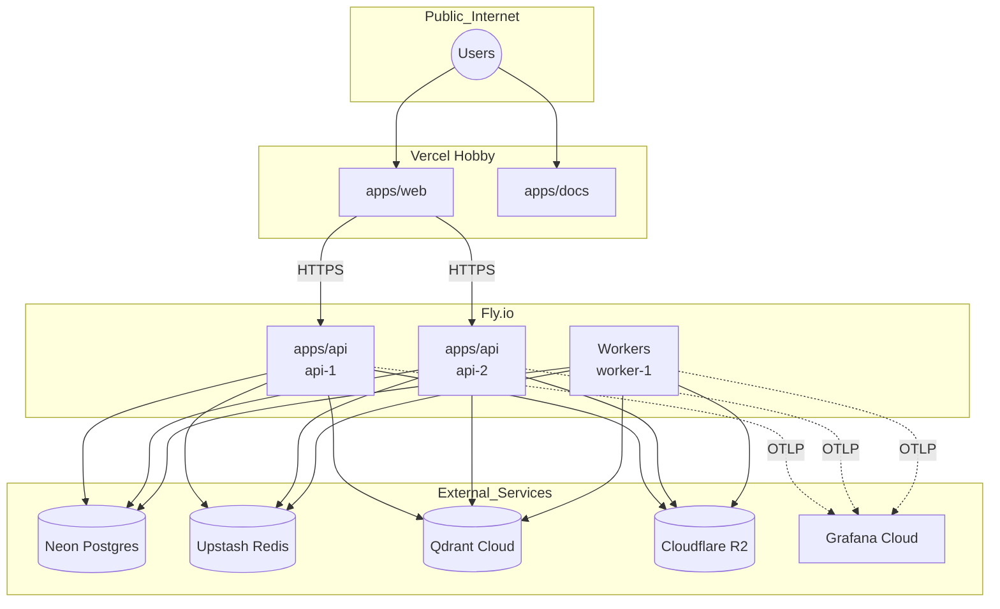

# ARCHITECTURE.md — System Architecture

**Status**: Living document. Amendments via ADR (see `DECISIONS.md`).

This document describes **how** ContractIQ works at the system
level. **What** was decided lives in `DECISIONS.md`. Every claim
here that reflects a technology choice cites the ADR that locked it.

## Reading Order

1. [System Overview](#system-overview)
2. [Bounded Contexts](#bounded-contexts)
3. [Component Map](#component-map)
4. [Key Data Flows](#key-data-flows)
5. [AI Agent Architecture](#ai-agent-architecture)
6. [RAG Pipeline](#rag-pipeline)
7. [Multi-Tenancy Enforcement](#multi-tenancy-enforcement)
8. [Data Model Overview](#data-model-overview)
9. [State & Context Propagation](#state--context-propagation)
10. [Observability](#observability)
11. [Security Architecture](#security-architecture)
12. [Deployment Topology](#deployment-topology)
13. [Non-Goals for MVP](#non-goals-for-mvp)
14. [Open Questions](#open-questions)

---

## System Overview

ContractIQ is an AI-native multi-tenant SaaS that reads contracts,
understands their structure, and helps humans review them faster.
The system decomposes into a thin edge (Next.js), a stateful API
(Fastify), asynchronous workers (BullMQ), and four external
stateful services (Postgres, Redis, Qdrant, R2). One
provider-abstracted LLM adapter (`packages/llm`) fronts all model
calls; the concrete provider is chosen per-environment and
per-task (ADR-012).



Six key qualities the architecture optimizes for:

1. **Tenant isolation** — two enforcement layers (ADR-011).
2. **Model agnosticism** — swap providers via env var (ADR-012).
3. **Cost efficiency at zero-revenue stage** — free-tier stack (ADR-024).
4. **Observability of LLM operations** — every call traced (ADR-019, R500).
5. **Reproducible LLM output** — strict schemas + goldens (ADR-014, ADR-019).
6. **Portfolio-visible engineering discipline** — CI gates on every PR (ADR-020).

---

## Bounded Contexts

The system is divided into **six bounded contexts**. Each has a
clear ownership boundary and communicates with others only through
explicit contracts (function calls in-process, events across
process boundaries). File organization in `apps/api/src/modules/`
mirrors these.

| Context             | Owns                                                          | Talks To                       |
| ------------------- | ------------------------------------------------------------- | ------------------------------ |
| **Identity**        | Users, sessions, orgs (workspaces), members, roles            | Everything (auth checks)       |
| **Workspace**       | Workspace settings, invites, quotas, playbooks                | Identity, Contracts            |
| **Contracts**       | Contract records, versions, files, metadata                   | Analysis, Workspace, Storage   |
| **Analysis**        | Clauses, classifications, risk scores, comparisons, summaries | Contracts, RAG, LLM            |
| **RAG**             | Chunks, embeddings, retrieval, reranking                      | Contracts, LLM, Vector DB      |
| **Conversations**   | Q&A sessions, messages, feedback                              | Contracts, RAG, LLM, Analysis  |

Contexts must not import each other's internals — only their
public interfaces (`index.ts`).

---

## Component Map

### Monorepo layout (recap of ADR-004)

```
apps/
├── web/              # Next.js Pages Router
├── api/              # Fastify + workers
└── docs/             # Nextra

packages/
├── shared/           # zod schemas, DTO types, error codes
├── ui/               # Radix-based components + design tokens
├── db/               # Prisma schema, client, seeds
├── llm/              # Provider abstraction, agent orchestrator
├── evals/            # Golden datasets, judges, scorers
└── config/           # Shared TS/Biome/Tailwind configs

tooling/
└── scripts/          # Dev, migration helpers, eval runners
```

### Application-layer building blocks (apps/api)

Each bounded context module in `apps/api/src/modules/<context>/`
follows a consistent shape:

```
<context>/
├── routes/           # Fastify route definitions (thin)
├── services/         # Business logic (framework-agnostic)
├── repositories/     # DB access, tenant-scoped
├── events/           # Domain events emitted or handled
├── jobs/             # BullMQ processors for this context
├── schemas.ts        # zod schemas (shared/ re-exported)
└── index.ts          # Public interface for other modules
```

DI wiring lives in `apps/api/src/container.ts` using awilix
(ADR-001). Lifetime scopes:

- `singleton`: config, LLM adapter, database client, Redis client.
- `scoped`: per-request context (workspace, user, request ID).
- `transient`: rarely used; explicit case only.

---

## Key Data Flows

Three journeys drive most of the system's complexity. Understanding
these is enough to reason about 80% of the code.

### Flow 1 — Contract Upload and Full Analysis

Trigger: user drops a PDF/DOCX into the web app.



Failure semantics:

- Upload validation fails → 400 with error code (no partial state).
- R2 put fails → 502, DB row never created.
- Job fails → BullMQ retries with backoff (3 attempts); after
  exhaustion, `status=FAILED` written, user notified via SSE.
- Idempotency: enqueue uses `contractId` as job key so replays
  are deduplicated.

### Flow 2 — Q&A Over a Contract (streaming)



Notes:

- Streaming is end-to-end SSE. The API acts as a passthrough with
  observability hooks; it does not buffer the full response.
- Citations reference chunk IDs; the web app resolves them to
  highlighted spans in the contract viewer.
- `tool_trace` is persisted for observability and later evals.

### Flow 3 — Cross-Contract Search



Notes:

- Cross-workspace search is impossible by construction (workspace_id
  filter injected in every Qdrant query at repository layer).
- Result count capped (default 20) to control cost.

---

## AI Agent Architecture

The `packages/llm` package encapsulates all AI logic. Callers
never construct provider-specific requests directly.

### Layered structure

```
packages/llm/
├── src/
│   ├── providers/
│   │   ├── gemini.ts
│   │   ├── claude.ts
│   │   ├── groq.ts
│   │   └── index.ts        # LLMProvider interface
│   ├── agent/
│   │   ├── loop.ts         # Agent loop (plan → tool → observe → repeat)
│   │   ├── tools/          # Tool registry
│   │   │   ├── extract-metadata.ts
│   │   │   ├── extract-clauses.ts
│   │   │   ├── classify-clause.ts
│   │   │   ├── assess-clause-risk.ts
│   │   │   ├── flag-missing-clauses.ts
│   │   │   ├── suggest-rewrite.ts
│   │   │   ├── hybrid-search.ts
│   │   │   ├── rerank.ts
│   │   │   └── generate-summary.ts
│   │   └── policies.ts     # Max steps, timeouts, budgets
│   ├── cache/
│   │   └── prompt-cache.ts # Provider-agnostic caching layer
│   ├── schemas/            # zod schemas for tool I/O
│   ├── retrieval/          # RAG pipeline (see next section)
│   └── evals/              # Interface points into packages/evals
```

### Agent loop (single iteration)



### Tool taxonomy (recap of Turn 5)

| Group        | Tools                                                                            |
| ------------ | -------------------------------------------------------------------------------- |
| Extraction   | `extract_metadata`, `extract_clauses`                                             |
| Analysis     | `classify_clause`, `assess_clause_risk`, `flag_missing_clauses`, `detect_unusual_terms` |
| Retrieval    | `hybrid_search`, `rerank`, `search_precedent`, `retrieve_playbook_guidance`      |
| Generation   | `suggest_rewrite`, `generate_summary`, `draft_negotiation_email`                 |
| Persistence  | (invoked outside the LLM boundary — never let the model write to DB directly)    |

Persistence is deliberately **out of the model's reach**. The
model returns structured results; the calling code persists.
This preserves auditability and rollback semantics.

### Policies (agent-level guardrails)

- `MAX_STEPS = 12` per invocation. Exceeding it fails the run.
- `MAX_TOKENS_PER_STEP = 8_000` (input + output combined).
- `TIMEOUT_MS = 60_000` per step, `180_000` total.
- `MAX_TOOL_CALLS = 20` total across a single run.
- If any policy is hit, run is marked `FAILED_POLICY` and full
  trace persisted for review.

### Provider abstraction

```typescript
// packages/llm/src/providers/index.ts (conceptual)
export interface LLMProvider {
  complete(req: CompletionRequest): Promise<CompletionResult>;
  stream(req: CompletionRequest): AsyncIterable<StreamChunk>;
  embed(req: EmbedRequest): Promise<EmbedResult>;
  rerank?(req: RerankRequest): Promise<RerankResult>;
  capabilities: ProviderCapabilities; // native caching? structured output? etc.
}
```

Provider selection:

1. Read env var `LLM_PROVIDER` (dev default: `gemini`, prod default: `claude`).
2. Read per-task overrides (e.g. `RISK_ANALYSIS_PROVIDER=claude`).
3. Instantiate via awilix container with capability check —
   caller declares required capabilities, adapter refuses if missing.

Fallback rules (dev vs prod configured in `container.ts`):

- On rate limit or 5xx: retry once, then fall back to secondary.
- On schema validation failure: repair prompt, then fall back.
- On timeout: no fallback (retries only), fail fast.

---

## RAG Pipeline

Full detail of the retrieval stage per ADR-013.



Pipeline stage contracts:

| Stage         | Input                      | Output                                 | Cache?      |
| ------------- | -------------------------- | -------------------------------------- | ----------- |
| Chunker       | Raw text                   | Chunks with offsets, section labels    | No          |
| Contextualizer| Chunk + doc structure      | Chunk with prepended context blurb     | Yes (24h)   |
| Embedder      | Text                       | Vector                                 | Yes (24h)   |
| Upsert        | Vector + payload           | Qdrant point ID                        | No          |
| Rewriter      | User question              | Dense query + sparse terms + filters   | Yes (10min) |
| Hybrid search | Query object               | Top-K point IDs with scores            | No          |
| Reranker      | Query + K docs             | Top-N docs with rerank scores          | Yes (10min) |

Caching keys include workspace_id to prevent cross-tenant cache hits.

Fallback if reranker is down:

- Skip rerank, take top-N from hybrid search directly.
- Log degraded mode span attribute for observability.

---

## Multi-Tenancy Enforcement

Two independent layers per ADR-011.

### Layer 1 — Application layer

- **Request context**: A Fastify plugin extracts workspace from
  the authenticated session, stores it in
  `AsyncLocalStorage`. Every request handler runs within this
  context; it is never passed as a function argument.
- **TenantScopedRepository**: A base class that all repositories
  extend. It reads the current workspace from context and injects
  it into every DB query. Raw Prisma calls outside repositories
  are banned by lint rule (R100.X — to be added in R100).
- **Tool executor**: Before running any agent tool, the executor
  asserts `workspace_id` matches the request context.

### Layer 2 — Database layer (RLS)

Every tenant-scoped table has a Postgres policy:

```sql
-- Conceptual (actual SQL in packages/db/migrations)
CREATE POLICY workspace_isolation ON contracts
  USING (workspace_id = current_setting('app.workspace_id')::uuid);
```

Prisma middleware sets `app.workspace_id` at the start of each
transaction. If the app layer's context is missing, the setting
is unset and every query returns zero rows. This means a bug in
the app layer that forgets the context degrades to "no data
returned", not "cross-tenant leak".

### Vector store (Qdrant)

Every point payload carries `workspace_id`. Every query includes
a payload filter `must: [{ key: "workspace_id", match: { value: <id> } }]`.
The retrieval repository refuses to build a query without a
workspace_id, throwing at construction time.

### Object store (R2)

Object keys are prefixed with workspace: `{workspace_id}/contracts/{contract_id}/{file_id}.pdf`.
Signed URLs are workspace-scoped and short-lived (5 min).

### Testing

Every repository has an integration test that verifies:

- A read in workspace A cannot see workspace B's rows.
- A write scoped to workspace A cannot mutate workspace B's rows.
- With no context, all reads return empty and all writes reject.

See R300 (testing standards) for how these live in the pyramid.

---

## Data Model Overview

High-level entities. Full schema lives in
`packages/db/schema.prisma`; the ERD renders in `apps/docs`.



Key invariants:

- Every table (except `User`, `Workspace`, `Session`) has
  `workspace_id`.
- `Contract` never mutates in place: new revisions are new
  `ContractVersion` rows. Analysis attaches to a specific version.
- `Message` and `ToolCall` are append-only; used for evals and audit.

Soft-delete: `deleted_at` on `Contract` and `Workspace`. Hard
delete is a separate admin operation with a 30-day retention.

---

## State & Context Propagation

| State kind         | Storage             | Lifetime            | Scope           |
| ------------------ | ------------------- | ------------------- | --------------- |
| Auth session       | Postgres via Better Auth | 30 days rolling | User            |
| Request context    | `AsyncLocalStorage` | Per request         | Request         |
| Prompt cache       | Redis + provider    | 5min–24h            | Global keyed    |
| Rate-limit counters| Redis (Upstash)     | Sliding window      | User + IP       |
| Job state          | Redis (BullMQ)      | Retention policy    | Job             |
| WebSocket/SSE conn | In-memory (Fastify) | Session             | Request         |
| Client cache       | Web (TanStack Query)| Component lifecycle | Per browser tab |

No in-memory state on the API is required for correctness (Fly.io
machines may restart). BullMQ workers are stateless too.

---

## Observability

Three signals via OpenTelemetry (OTLP export to Grafana Cloud):

### Traces

- Every HTTP request opens a root span.
- Every downstream call (DB, Redis, R2, Qdrant, LLM) is a child span.
- **LLM spans** carry attributes:
  - `llm.provider`, `llm.model`, `llm.tool_name`
  - `llm.input_tokens`, `llm.output_tokens`, `llm.cached_tokens`
  - `llm.cost_usd_estimated`
  - `llm.schema_valid` (bool), `llm.repair_attempts`
  - `llm.latency_first_token_ms`, `llm.latency_total_ms`
- Agent loop opens a span per step with `agent.step_index`.

### Metrics

- HTTP: request rate, latency histogram, error rate — per route + tenant.
- LLM: token consumption per provider, cache hit rate, schema-repair
  rate, cost per request.
- Queue: depth per queue, job latency, failure rate.
- RAG: retrieval latency per stage, rerank score distribution.

### Logs

- Structured JSON via `pino`.
- Every log line carries `request_id`, `workspace_id`, `user_id`.
- LLM logs redact input/output body by default; opt-in via env
  var for local debugging only.

### Alerting (post-MVP but designed for)

- LLM cost per workspace per hour above threshold.
- Schema-repair rate >5% sustained.
- Retrieval latency p95 above threshold.
- Job failure rate >2%.

---

## Security Architecture

### Auth flow (Better Auth per ADR-010)



Sessions are opaque tokens in Postgres (not JWT) to allow
revocation. 2FA and passkeys are opt-in per user. Impersonation
is admin-only, always logged with the impersonator's identity in
every downstream span.

### Secrets

- No secrets in the repo; `.env.local` for dev is gitignored (ADR-024).
- Production secrets in Fly.io secrets + Vercel env; rotated on a
  documented schedule.
- LLM API keys are read from env at startup; hot rotation not
  supported (restart required).

### Threats out of scope for MVP

- DDoS mitigation beyond Cloudflare defaults.
- On-prem or air-gapped deployments.
- Zero-knowledge encryption (contracts are readable by our servers).
- Complete SOC2 audit trail (audit log exists but is not certified).

Full threat model lives in `SECURITY.md` (post-MVP task).

---

## Deployment Topology



Environment matrix:

| Env        | Frontend        | Backend        | DB               | Notes                          |
| ---------- | --------------- | -------------- | ---------------- | ------------------------------ |
| local      | localhost:3000  | localhost:3001 | Docker Postgres  | Testcontainers for tests       |
| preview    | Vercel preview  | Fly.io preview | Neon branch      | Per-PR ephemeral               |
| production | Vercel prod     | Fly.io prod    | Neon main branch | LLM provider = Claude Haiku    |

Regions: all services co-located in `iad`/`us-east` to minimize
cross-region latency. Fly.io autoscale (min 1, max 3 machines)
based on request rate.

---

## Non-Goals for MVP

The following are explicitly **out of scope** for MVP. Ship
without them; revisit post-MVP.

- **Real-time collaboration** on a single contract (Y.js / CRDTs).
- **Live document editing** in the browser.
- **Signature workflows** (DocuSign integration).
- **Custom playbook builder UI** (playbooks seeded in DB only).
- **SSO / SAML** for identity.
- **Fine-tuning** of any model on customer data.
- **Full audit trail export** for compliance.
- **Mobile apps** (responsive web is enough).
- **On-prem deployment** or self-hosted install.

If a task's scope pulls in any of these, stop and confirm with
Dandi that scope is being expanded.

---

## Open Questions

Tracked here explicitly. Each resolves into a new ADR when answered.

| ID  | Question                                                             | Blocker for |
| --- | -------------------------------------------------------------------- | ----------- |
| OQ-1 | Which reranker: `bge-reranker-v2-m3` self-hosted or Cohere free tier? | RAG impl    |
| OQ-2 | Should we cache reranker outputs at request level or session level?  | RAG impl    |
| OQ-3 | Do we need workspace-level LLM cost quotas from day 1?               | Cost policy |
| OQ-4 | Should embeddings be re-generated when we switch providers?          | Provider swap |
| OQ-5 | Do we store the raw file forever, or purge after N days?             | Data retention |
| OQ-6 | Do we need a "shared workspace" concept, or is single-tenant per workspace enough? | Multi-user |

None of these block Fase 1C or Fase 1D. Flag when they become urgent.

---

## Changelog

- **2026-07-21** — Initial version. All content locked against
  ADR-001 through ADR-025.
