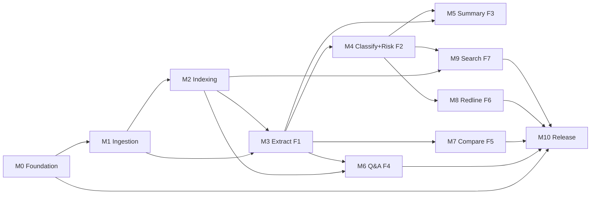

# MVP.md — Scope, Milestones, and Task Backlog

**Status**: Living document. New tasks are appended; existing task
IDs are never reused. Completed tasks stay in the file with a
`✓` marker.

`DECISIONS.md` says **what** we build. `ARCHITECTURE.md` says
**how** components fit together. This file says **in what order,
with what verification, satisfying which acceptance criteria.**

## Reading Order

1. [How To Read](#how-to-read)
2. [Milestone Overview](#milestone-overview)
3. [M0 — Foundation](#m0--foundation)
4. [M1 — Ingestion Enabler](#m1--ingestion-enabler)
5. [M2 — Indexing Enabler](#m2--indexing-enabler)
6. [F1 — Extract (M3)](#f1--extract-m3)
7. [F2 — Classify + Risk (M4)](#f2--classify--risk-m4)
8. [F3 — Summary (M5)](#f3--summary-m5)
9. [F4 — Q&A (M6)](#f4--qa-m6)
10. [F5 — Compare (M7)](#f5--compare-m7)
11. [F6 — Redline (M8)](#f6--redline-m8)
12. [F7 — Cross-Contract Search (M9)](#f7--cross-contract-search-m9)
13. [M10 — Release](#m10--release)
14. [Dependency Graph](#dependency-graph)
15. [Release Checkpoints](#release-checkpoints)
16. [Definition of Done (per feature)](#definition-of-done-per-feature)
17. [Deferred / Non-MVP](#deferred--non-mvp)

---

## How To Read

**Task ID convention**: `T-###` global counter, stable forever.
Never renumbered even if a task is deleted or reshuffled.

**Task shape**:

```
### T-###: title
- **Deps**: T-###, T-### (or "none")
- **Est**: S | M | L (S ≤ 1h, M ≤ 4h, L ≤ 1 day; solo dev, focused)
- **Files**: primary files touched
- **Rules**: R### citations
- **AC**: which acceptance criteria this task satisfies
- **Verify**: exact command + expected outcome
```

**Feature shape**: Each user feature (`F#`) has three sections:

1. **User Story** — 1–2 sentences from user's POV.
2. **Acceptance Criteria** — `AC-F#.#` numbered, verifiable outcomes.
3. **Tasks** — the `T-###` list that delivers the criteria.

**Milestones** (`M#`) are checkpoint deliveries — see
[Release Checkpoints](#release-checkpoints) for what each unlocks.

**Task states**:

- `[ ]` planned
- `[~]` in progress
- `[✓]` done and verified
- `[!]` blocked (comment why)

Update state in-place when the state changes. Do not rewrite tasks.

---

## Milestone Overview

| Milestone | Focus                          | Tasks         | Delivery                                    |
| --------- | ------------------------------ | ------------- | ------------------------------------------- |
| M0        | Foundation                     | T-001..T-024  | Repo runs end-to-end, auth works, no features |
| M1        | Ingestion enabler              | T-025..T-030  | Upload PDF/DOCX, extract text, persist        |
| M2        | Indexing enabler               | T-031..T-036  | Chunk, contextualize, embed, Qdrant upsert    |
| M3 (F1)   | Extract                        | T-037..T-044  | Metadata + clause list per contract           |
| M4 (F2)   | Classify + Risk                | T-045..T-054  | Clause categories + risk scores + missing flags |
| M5 (F3)   | Summary                        | T-055..T-060  | Executive summary per contract                |
| M6 (F4)   | Q&A                            | T-061..T-070  | Streaming Q&A with citations                  |
| M7 (F5)   | Compare                        | T-071..T-076  | Semantic diff between two versions            |
| M8 (F6)   | Redline                        | T-077..T-082  | Rewrite suggestions per clause                |
| M9 (F7)   | Cross-Contract Search          | T-083..T-088  | Search across workspace's contracts           |
| M10       | Release                        | T-089..T-098  | Landing, demo, docs site, v0.1.0 tag          |

**Total**: 98 tasks. Solo dev, part-time, realistic target 4–6 months
end-to-end with disciplined scope. Feature-flag anything that isn't
in this list.

---

## M0 — Foundation

Foundation tasks have no user story — they enable all features.
Acceptance criterion for M0 is: **fresh clone → `pnpm i && pnpm dev` boots web + api + docs, user can sign up and see empty workspace**.

### T-001: Init pnpm workspaces + Turborepo
- **Deps**: none · **Est**: S
- **Files**: `package.json`, `pnpm-workspace.yaml`, `turbo.json`, `.npmrc`
- **Rules**: R000.2
- **Verify**: `pnpm --version && pnpm turbo --version` both succeed; `pnpm ls -r --depth -1` shows workspace tree.

### T-002: Root Biome + editorconfig + gitattributes
- **Deps**: T-001 · **Est**: S
- **Files**: `biome.json`, `.editorconfig`, `.gitattributes`
- **Rules**: R100 (to be defined)
- **Verify**: `pnpm biome check .` runs (may report zero files); `.editorconfig` respected by editor.

### T-003: Root TypeScript config + strict flags
- **Deps**: T-002 · **Est**: S
- **Files**: `tsconfig.base.json`, `tsconfig.json`
- **Rules**: ADR-003
- **Verify**: `pnpm exec tsc --version` succeeds; `strict`, `noUncheckedIndexedAccess`, `exactOptionalPropertyTypes` present in base config.

### T-004: packages/config (shared configs)
- **Deps**: T-003 · **Est**: S
- **Files**: `packages/config/tsconfig/*.json`, `packages/config/biome/*.json`, `packages/config/tailwind/*.ts`
- **Rules**: ADR-004
- **Verify**: A downstream package can extend `@contractiq/config/tsconfig/node.json` without errors.

### T-005: packages/shared (zod schemas, DTO types)
- **Deps**: T-004 · **Est**: S
- **Files**: `packages/shared/src/{schemas,types,errors,constants}/index.ts`
- **Rules**: ADR-014
- **Verify**: `pnpm turbo type-check --filter=@contractiq/shared` passes.

### T-006: Lefthook + commitlint + Conventional Commits
- **Deps**: T-004 · **Est**: S
- **Files**: `lefthook.yml`, `commitlint.config.ts`
- **Rules**: ADR-021, R200 (to be defined)
- **Verify**: `lefthook install`, then `git commit -m "bad msg"` on a staged file is rejected; `git commit -m "chore: valid"` accepted.

### T-007: SSH signing enabled + verify GitHub shows Verified
- **Deps**: T-006 · **Est**: S
- **Files**: local git config (not committed)
- **Rules**: ADR-021
- **Verify**: The most recent commit shows "Verified" badge on GitHub.

### T-008: packages/db — Prisma init + schema skeleton
- **Deps**: T-005 · **Est**: M
- **Files**: `packages/db/schema.prisma`, `packages/db/src/client.ts`, `packages/db/.env.example`
- **Rules**: ADR-005, ADR-006
- **Verify**: `pnpm --filter @contractiq/db prisma validate` passes; schema has `User`, `Workspace`, `Session`, `Membership` only.

### T-009: Neon dev DB provisioned + connection string in local `.env`
- **Deps**: T-008 · **Est**: S
- **Files**: local `.env.local` (not committed)
- **Rules**: ADR-005
- **Verify**: `pnpm --filter @contractiq/db prisma db push --preview-feature` succeeds against Neon.

### T-010: Testcontainers Postgres for local tests
- **Deps**: T-008 · **Est**: M
- **Files**: `packages/db/src/test/container.ts`, `packages/config/vitest/base.ts`
- **Rules**: ADR-019
- **Verify**: `pnpm --filter @contractiq/db test` boots container, applies schema, tears down.

### T-011: apps/api — Fastify skeleton + awilix container
- **Deps**: T-005 · **Est**: M
- **Files**: `apps/api/src/{server,container,config}/*.ts`, `apps/api/package.json`
- **Rules**: ADR-001
- **Verify**: `pnpm --filter @contractiq/api dev`; `curl localhost:3001/healthz` returns `{"ok":true}`.

### T-012: Fastify plugins — zod type provider, error handler, request logger
- **Deps**: T-011 · **Est**: M
- **Files**: `apps/api/src/plugins/*.ts`
- **Rules**: ADR-001
- **Verify**: Malformed request body returns structured 400; each request logs a JSON line with `request_id`.

### T-013: Multi-tenancy — AsyncLocalStorage context + TenantScopedRepository base
- **Deps**: T-011, T-008 · **Est**: L
- **Files**: `apps/api/src/tenancy/*.ts`, `packages/db/src/repository-base.ts`
- **Rules**: ADR-011
- **Verify**: Unit test asserts a repo query without context returns empty; with context, returns matching rows only.

### T-014: Postgres RLS policies for tenant tables
- **Deps**: T-013 · **Est**: M
- **Files**: `packages/db/migrations/*_rls.sql`
- **Rules**: ADR-011
- **Verify**: Integration test connects with two workspace IDs; each sees only its own rows.

### T-015: Better Auth integration (email/password + session in Postgres)
- **Deps**: T-011, T-008 · **Est**: L
- **Files**: `apps/api/src/modules/identity/*`, `packages/db/schema.prisma` (auth tables)
- **Rules**: ADR-010
- **Verify**: `POST /auth/sign-up` creates user; `POST /auth/sign-in` returns Set-Cookie; `GET /me` returns user with valid cookie.

### T-016: Better Auth organization plugin (workspaces + roles)
- **Deps**: T-015 · **Est**: M
- **Files**: `apps/api/src/modules/workspace/*`
- **Rules**: ADR-010, ADR-011
- **Verify**: New user auto-provisioned into a "Personal" workspace; can create additional workspaces; role assignment persists.

### T-017: Redis + Upstash + BullMQ setup
- **Deps**: T-011 · **Est**: M
- **Files**: `apps/api/src/queue/*`, `apps/api/src/workers/*`
- **Rules**: ADR-009
- **Verify**: Enqueue a no-op job; separate worker process picks it up; both processes log the job id.

### T-018: Cloudflare R2 client abstraction
- **Deps**: T-011 · **Est**: M
- **Files**: `apps/api/src/storage/r2-client.ts`, `apps/api/src/storage/interface.ts`
- **Rules**: ADR-008
- **Verify**: Integration test uploads bytes, gets signed URL, downloads bytes back, deletes.

### T-019: Qdrant Cloud client abstraction + workspace-scoped collection helper
- **Deps**: T-011 · **Est**: M
- **Files**: `apps/api/src/rag/qdrant-client.ts`, `apps/api/src/rag/interface.ts`
- **Rules**: ADR-007, ADR-011
- **Verify**: Create a test collection with dummy vector; query with workspace filter returns it; query with wrong workspace returns empty.

### T-020: packages/llm — LLMProvider interface + Gemini adapter (primary in free tier)
- **Deps**: T-005 · **Est**: L
- **Files**: `packages/llm/src/{providers,agent,cache,schemas}/*`
- **Rules**: ADR-026, ADR-014
- **Verify**: `pnpm --filter @contractiq/llm test:providers:gemini` sends a hello prompt, gets a completion, validates schema.

### T-021: packages/llm — Claude adapter + Groq adapter
- **Deps**: T-020 · **Est**: M
- **Files**: `packages/llm/src/providers/{claude,groq}.ts`
- **Rules**: ADR-012
- **Verify**: Same integration test suite as T-020 passes for both providers.

### T-022: OpenTelemetry SDK + Grafana Cloud OTLP exporter
- **Deps**: T-011 · **Est**: M
- **Files**: `apps/api/src/observability/otel.ts`
- **Rules**: R400 (to be defined)
- **Verify**: A test request produces a trace visible in Grafana Cloud within 60s.

### T-023: apps/web — Next.js Pages Router skeleton + Better Auth client
- **Deps**: T-015 · **Est**: M
- **Files**: `apps/web/src/pages/{_app,index,auth/*}.tsx`
- **Rules**: ADR-002, ADR-010
- **Verify**: `pnpm --filter @contractiq/web dev`; sign-up flow works end-to-end in browser.

### T-024: CI/CD — GitHub Actions with all 15 gates
- **Deps**: T-006, T-010, T-011, T-023 · **Est**: L
- **Files**: `.github/workflows/*.yml`
- **Rules**: ADR-020
- **Verify**: Draft PR triggers all 15 gates; all pass on a no-op change.

---

## M1 — Ingestion Enabler

**Purpose**: turn an uploaded file into stored, extracted text.

### T-025: apps/api — upload endpoint (multipart, size + type validation)
- **Deps**: T-018 · **Est**: M
- **Files**: `apps/api/src/modules/contracts/routes/upload.ts`
- **Rules**: R400
- **Verify**: `curl -F "file=@sample.pdf" localhost:3001/contracts` returns 202 with `contractId`; file present in R2 under workspace-prefixed key.

### T-026: apps/api — Contract entity (Prisma model + repository)
- **Deps**: T-013, T-014 · **Est**: M
- **Files**: `packages/db/schema.prisma` (Contract, ContractVersion), `apps/api/src/modules/contracts/repositories/*`
- **Rules**: ADR-011
- **Verify**: Prisma migration applies; repository test creates + reads + soft-deletes.

### T-027: Text extraction — PDF (pdf-parse or unpdf)
- **Deps**: T-025, T-026 · **Est**: M
- **Files**: `apps/api/src/modules/contracts/services/extract-text.ts`
- **Rules**: R500 (to be defined)
- **Verify**: Unit test extracts text from `fixtures/nda-en.pdf`; assertion on known phrase presence.

### T-028: Text extraction — DOCX (mammoth)
- **Deps**: T-027 · **Est**: S
- **Files**: same service, additional handler
- **Rules**: R500
- **Verify**: Unit test on `fixtures/service-agreement-id.docx`; known phrase asserted.

### T-029: BullMQ job — `contract.ingest`
- **Deps**: T-017, T-027, T-028 · **Est**: M
- **Files**: `apps/api/src/workers/contract-ingest.worker.ts`
- **Rules**: ADR-009
- **Verify**: Enqueue with contract id; worker updates `Contract.status` PENDING→EXTRACTED; failure retries 3x with backoff.

### T-030: SSE stream — contract ingestion status
- **Deps**: T-029 · **Est**: M
- **Files**: `apps/api/src/modules/contracts/routes/events.ts`, `apps/web/src/hooks/useContractStream.ts`
- **Rules**: none
- **Verify**: E2E test uploads contract, subscribes to `/contracts/:id/events`, receives `extracted` event within 30s.

---

## M2 — Indexing Enabler

**Purpose**: turn extracted text into searchable, workspace-scoped
vectors in Qdrant.

### T-031: Semantic chunker (section/clause boundary aware, 15% overlap)
- **Deps**: T-027 · **Est**: L
- **Files**: `apps/api/src/rag/chunker.ts`
- **Rules**: ADR-013
- **Verify**: Unit test on fixture: chunk count ≥ N, no chunk crosses hard section boundary, overlap ≥15%.

### T-032: LLM contextualizer (prepend 1–2 sentence blurb per chunk)
- **Deps**: T-020, T-031 · **Est**: M
- **Files**: `apps/api/src/rag/contextualize.ts`
- **Rules**: ADR-013, ADR-014
- **Verify**: Unit test with mocked LLM: input chunk + doc; output chunk starts with contextual blurb; original text preserved verbatim.

### T-033: Embedder (native provider or bge-m3 self-hosted)
- **Deps**: T-020 · **Est**: M
- **Files**: `packages/llm/src/embed.ts`
- **Rules**: ADR-012
- **Verify**: Integration test embeds 3 texts; vectors have consistent dimension; cosine similarity between paraphrases > threshold.

### T-034: Prompt cache layer (Redis + provider-native fallback)
- **Deps**: T-017, T-020 · **Est**: M
- **Files**: `packages/llm/src/cache/prompt-cache.ts`
- **Rules**: ADR-014
- **Verify**: Repeat call to contextualizer within TTL hits cache; miss rate < 5% on golden dataset replay.

### T-035: BullMQ job — `contract.index`
- **Deps**: T-019, T-031, T-032, T-033 · **Est**: M
- **Files**: `apps/api/src/workers/contract-index.worker.ts`
- **Rules**: ADR-009, ADR-013
- **Verify**: Enqueue after `contract.ingest`; Qdrant collection contains N points with correct workspace_id payload; `Contract.status` = INDEXED.

### T-036: Reranker adapter (bge-reranker-v2-m3 or Cohere free tier)
- **Deps**: T-020 · **Est**: M
- **Files**: `packages/llm/src/rerank.ts`
- **Rules**: ADR-013, OQ-1 resolved
- **Verify**: Unit test: given query + 10 candidate texts, rerank moves the intuitively best one into top-3.

---

## F1 — Extract (M3)

**User Story**
> As a workspace member, I upload a contract and receive its
> structured metadata (parties, dates, jurisdiction, governing
> law) and a clause-by-clause breakdown, so I can navigate the
> document by structure instead of scrolling.

**Acceptance Criteria**
- **AC-F1.1**: Given a valid PDF or DOCX contract, when I upload
  it, then within 60s I can see extracted metadata (at least:
  parties, effective_date, jurisdiction).
- **AC-F1.2**: The system extracts ≥90% of clauses (measured on
  golden dataset), with clause boundaries within ±2 sentences
  of ground truth.
- **AC-F1.3**: Each extracted clause has a stable `clauseId`,
  offset in the original document, and preserves original wording
  verbatim.
- **AC-F1.4**: Metadata and clauses are workspace-scoped and
  invisible to other workspaces.
- **AC-F1.5**: Both English and Indonesian contracts work
  equivalently (per ADR-025).

### T-037: zod schemas for ContractMetadata + Clause
- **Deps**: T-005 · **Est**: S
- **Files**: `packages/shared/src/schemas/contract.ts`
- **Rules**: ADR-014
- **AC**: AC-F1.1, AC-F1.3
- **Verify**: `pnpm --filter @contractiq/shared test` — schema round-trips a fixture.

### T-038: LLM tool — `extract_metadata`
- **Deps**: T-020, T-037 · **Est**: M
- **Files**: `packages/llm/src/agent/tools/extract-metadata.ts`
- **Rules**: R500
- **AC**: AC-F1.1
- **Verify**: Golden dataset run: metadata accuracy ≥90% across 20 contracts.

### T-039: LLM tool — `extract_clauses`
- **Deps**: T-020, T-037 · **Est**: L
- **Files**: `packages/llm/src/agent/tools/extract-clauses.ts`
- **Rules**: R500
- **AC**: AC-F1.2, AC-F1.3
- **Verify**: Golden dataset: mean clause recall ≥90%, mean precision ≥85%.

### T-040: Agent — `analyzeContract` (orchestrates T-038 + T-039 + persists)
- **Deps**: T-038, T-039, T-026 · **Est**: L
- **Files**: `apps/api/src/modules/analysis/services/analyze-contract.ts`
- **Rules**: R500
- **AC**: AC-F1.1, AC-F1.2, AC-F1.4
- **Verify**: Integration test: uploads contract, awaits analysis, DB has metadata + N clauses with workspace_id.

### T-041: BullMQ job — `contract.analyze` (extract stage)
- **Deps**: T-035, T-040 · **Est**: M
- **Files**: `apps/api/src/workers/contract-analyze.worker.ts`
- **Rules**: ADR-009
- **AC**: AC-F1.1
- **Verify**: Full pipeline: upload → ingest → index → analyze → SSE `analyzed` event.

### T-042: API — `GET /contracts/:id` returns metadata + clause tree
- **Deps**: T-040 · **Est**: S
- **Files**: `apps/api/src/modules/contracts/routes/get.ts`
- **Rules**: ADR-011
- **AC**: AC-F1.1, AC-F1.3, AC-F1.4
- **Verify**: Contract test: response matches OpenAPI schema; cross-workspace request returns 404.

### T-043: Web — contract detail page (metadata panel + clause list)
- **Deps**: T-042, T-023, T-030 · **Est**: L
- **Files**: `apps/web/src/pages/contracts/[id]/index.tsx`, components in `packages/ui`
- **Rules**: R600 (to be defined)
- **AC**: AC-F1.1, AC-F1.3
- **Verify**: E2E: sign in, upload fixture, land on detail page, see clauses render.

### T-044: Bilingual smoke — Indonesian contract fixture
- **Deps**: T-041 · **Est**: S
- **Files**: `packages/evals/fixtures/id/*`
- **Rules**: ADR-025
- **AC**: AC-F1.5
- **Verify**: Golden dataset run against ID fixtures matches EN quality within 5% delta.

---

## F2 — Classify + Risk (M4)

**User Story**
> As a reviewer, I want each clause categorized (liability, IP,
> payment, termination, confidentiality, etc.), flagged for risk
> level with reasoning, and warned about clauses that should exist
> but don't, so I can prioritize where to focus my review time.

**Acceptance Criteria**
- **AC-F2.1**: Every extracted clause has exactly one primary
  category from a fixed taxonomy (≥12 categories).
- **AC-F2.2**: Every clause has a risk score 1–10 with a text
  rationale ≥ 20 words citing the specific concerning language.
- **AC-F2.3**: The system flags at least "expected but missing"
  clauses per contract type (e.g., an NDA without a term/duration).
- **AC-F2.4**: Category and risk assignments are deterministic
  within a session (same input → same output when cache hits).
- **AC-F2.5**: Classification accuracy ≥85% (macro F1) on golden
  dataset; risk score correlation with human labels ≥0.7.

### T-045: Clause taxonomy definition + zod enum
- **Deps**: T-005 · **Est**: S
- **Files**: `packages/shared/src/schemas/clause-taxonomy.ts`
- **Rules**: R500
- **AC**: AC-F2.1
- **Verify**: `pnpm --filter @contractiq/shared test`: taxonomy exports ≥12 categories, each with description.

### T-046: LLM tool — `classify_clause`
- **Deps**: T-020, T-045 · **Est**: M
- **Files**: `packages/llm/src/agent/tools/classify-clause.ts`
- **Rules**: R500
- **AC**: AC-F2.1, AC-F2.5
- **Verify**: Golden dataset: macro F1 ≥85%.

### T-047: LLM tool — `assess_clause_risk`
- **Deps**: T-020, T-046 · **Est**: L
- **Files**: `packages/llm/src/agent/tools/assess-clause-risk.ts`
- **Rules**: R500
- **AC**: AC-F2.2, AC-F2.5
- **Verify**: Golden dataset: Spearman correlation with human labels ≥0.7.

### T-048: LLM tool — `flag_missing_clauses`
- **Deps**: T-020, T-045 · **Est**: M
- **Files**: `packages/llm/src/agent/tools/flag-missing-clauses.ts`
- **Rules**: R500
- **AC**: AC-F2.3
- **Verify**: Fixture: NDA missing "duration" clause → flagged; NDA with duration → not flagged.

### T-049: LLM tool — `detect_unusual_terms` (optional per contract type)
- **Deps**: T-047 · **Est**: M
- **Files**: `packages/llm/src/agent/tools/detect-unusual-terms.ts`
- **Rules**: R500
- **AC**: AC-F2.2
- **Verify**: Golden dataset: unusual-term precision ≥70% (LLM-as-judge).

### T-050: Persist Classification + RiskAssessment (Prisma models + repo)
- **Deps**: T-046, T-047, T-026 · **Est**: M
- **Files**: `packages/db/schema.prisma`, `apps/api/src/modules/analysis/repositories/*`
- **Rules**: ADR-011
- **AC**: AC-F2.1, AC-F2.2, AC-F2.4
- **Verify**: Integration test: analysis writes N rows per contract; tenant scope enforced.

### T-051: Extend `analyzeContract` agent to run classify + risk
- **Deps**: T-040, T-046, T-047, T-048, T-050 · **Est**: M
- **Files**: `apps/api/src/modules/analysis/services/analyze-contract.ts`
- **Rules**: R500
- **AC**: AC-F2.1, AC-F2.2, AC-F2.3
- **Verify**: E2E: analyzed contract has every clause classified + risk-scored + missing list populated.

### T-052: API — `GET /contracts/:id/analysis`
- **Deps**: T-051 · **Est**: S
- **Files**: `apps/api/src/modules/analysis/routes/get.ts`
- **Rules**: ADR-011
- **AC**: AC-F2.1, AC-F2.2, AC-F2.3
- **Verify**: Response includes clauses with `classification`, `risk`, and `missingClauses[]`.

### T-053: Web — classification badge + risk indicator per clause
- **Deps**: T-043, T-052 · **Est**: M
- **Files**: `apps/web/src/pages/contracts/[id]/index.tsx`, `packages/ui/src/RiskBadge/*`
- **Rules**: R600
- **AC**: AC-F2.1, AC-F2.2
- **Verify**: E2E: badge and risk pill render per clause; sortable by risk.

### T-054: Web — missing-clauses banner + drill-in
- **Deps**: T-053 · **Est**: S
- **Files**: `apps/web/src/components/MissingClausesBanner.tsx`
- **Rules**: R600, R604 (to be defined)
- **AC**: AC-F2.3
- **Verify**: E2E: banner visible when `missingClauses.length > 0`; click opens explanation panel.

---

## F3 — Summary (M5)

**User Story**
> As a busy reviewer, I want a 3-paragraph executive summary of a
> contract that highlights key terms, obligations, and risks, so I
> can decide whether the contract deserves a full review.

**Acceptance Criteria**
- **AC-F3.1**: Summary is 3 paragraphs (or 150–300 words) covering:
  parties + scope, key obligations, top 3 risks.
- **AC-F3.2**: Summary cites specific clauses by ID (used for
  navigation in the UI).
- **AC-F3.3**: Summary regenerates when a new contract version is
  uploaded; previous summary is preserved for audit.
- **AC-F3.4**: LLM-as-judge accuracy ≥90% ("summary faithful to
  source") on golden dataset.

### T-055: LLM tool — `generate_summary`
- **Deps**: T-051 · **Est**: M
- **Files**: `packages/llm/src/agent/tools/generate-summary.ts`
- **Rules**: R500
- **AC**: AC-F3.1, AC-F3.2
- **Verify**: Golden dataset: LLM-as-judge faithfulness ≥90%.

### T-056: Persist ContractSummary (Prisma + repo)
- **Deps**: T-050 · **Est**: S
- **Files**: `packages/db/schema.prisma`, `apps/api/src/modules/analysis/repositories/summary.ts`
- **Rules**: ADR-011
- **AC**: AC-F3.3
- **Verify**: Integration test: two versions of same contract yield two summaries with distinct IDs.

### T-057: Extend `analyzeContract` agent to generate summary
- **Deps**: T-051, T-055, T-056 · **Est**: S
- **Files**: `apps/api/src/modules/analysis/services/analyze-contract.ts`
- **Rules**: R500
- **AC**: AC-F3.1
- **Verify**: E2E: analyzed contract has summary row.

### T-058: API — `GET /contracts/:id/summary`
- **Deps**: T-057 · **Est**: S
- **Files**: `apps/api/src/modules/analysis/routes/summary.ts`
- **Rules**: ADR-011
- **AC**: AC-F3.1, AC-F3.2
- **Verify**: Response includes summary + clause citations resolvable to clause IDs.

### T-059: Web — summary panel with clickable citations
- **Deps**: T-058, T-043 · **Est**: M
- **Files**: `apps/web/src/components/SummaryPanel.tsx`
- **Rules**: R600
- **AC**: AC-F3.1, AC-F3.2
- **Verify**: E2E: click citation scrolls to referenced clause; keyboard nav works.

### T-060: LLM-as-judge scorer for summary faithfulness
- **Deps**: T-055 · **Est**: M
- **Files**: `packages/evals/src/judges/summary-faithfulness.ts`
- **Rules**: ADR-019
- **AC**: AC-F3.4
- **Verify**: CI eval gate runs judge on golden dataset; blocks PR if below threshold.

---

## F4 — Q&A (M6)

**User Story**
> As a reviewer with a specific question about a contract, I want
> to chat with the document — get streaming answers with citations
> to the exact clauses — so I don't have to skim the whole thing.

**Acceptance Criteria**
- **AC-F4.1**: I can ask a question about a specific contract; a
  first token appears within 2s (p95).
- **AC-F4.2**: Every answer includes ≥1 citation resolvable to a
  clause or chunk; clicking navigates to the source text.
- **AC-F4.3**: Multi-turn conversation preserves context; follow-up
  "what about X?" understands "X" refers to earlier discussion.
- **AC-F4.4**: LLM-as-judge groundedness ≥90% (answer supported
  by cited context).
- **AC-F4.5**: Q&A honors workspace scope — cannot be manipulated
  via prompt injection to retrieve other workspaces' contracts.

### T-061: Conversation + Message + ToolCall Prisma models
- **Deps**: T-026 · **Est**: M
- **Files**: `packages/db/schema.prisma`, `apps/api/src/modules/conversations/repositories/*`
- **Rules**: ADR-011
- **AC**: AC-F4.3
- **Verify**: Integration test: create conversation, append 3 messages, retrieve in order.

### T-062: LLM tool — `hybrid_search` (dense + BM25 + workspace filter)
- **Deps**: T-019, T-036 · **Est**: M
- **Files**: `packages/llm/src/agent/tools/hybrid-search.ts`
- **Rules**: ADR-013, ADR-011
- **AC**: AC-F4.5
- **Verify**: Unit test: query with workspace A only returns A's chunks even when B's are more similar.

### T-063: Agent — chat loop with tool use + streaming
- **Deps**: T-020, T-062 · **Est**: L
- **Files**: `packages/llm/src/agent/loop.ts` (chat mode)
- **Rules**: R500
- **AC**: AC-F4.1, AC-F4.3
- **Verify**: Unit test: multi-turn conversation with tool call in turn 2 preserves state; token stream begins ≤2s.

### T-064: API — `POST /conversations/:id/messages` (SSE stream)
- **Deps**: T-061, T-063 · **Est**: M
- **Files**: `apps/api/src/modules/conversations/routes/messages.ts`
- **Rules**: ADR-011
- **AC**: AC-F4.1, AC-F4.2, AC-F4.5
- **Verify**: E2E: post question; SSE stream yields tokens + `done` event; response persisted.

### T-065: API — `POST /contracts/:id/conversations` (start conversation)
- **Deps**: T-064 · **Est**: S
- **Files**: `apps/api/src/modules/conversations/routes/create.ts`
- **Rules**: ADR-011
- **AC**: AC-F4.3
- **Verify**: Contract test: conversation scoped to a contract; cross-workspace request 404.

### T-066: Web — chat UI with streaming, citations, keyboard shortcuts
- **Deps**: T-064, T-043 · **Est**: L
- **Files**: `apps/web/src/components/Chat/*`
- **Rules**: R600, R603 (to be defined)
- **AC**: AC-F4.1, AC-F4.2, AC-F4.3
- **Verify**: E2E: ask question, see streamed answer, click citation, focus on clause.

### T-067: Prompt-injection defense — instruction hierarchy + citation gate
- **Deps**: T-063 · **Est**: M
- **Files**: `packages/llm/src/agent/policies.ts`, prompts
- **Rules**: R400, R500
- **AC**: AC-F4.5
- **Verify**: Red-team suite of 20 injection attempts; all fail to leak or cross-tenant.

### T-068: LLM-as-judge for Q&A groundedness
- **Deps**: T-063 · **Est**: M
- **Files**: `packages/evals/src/judges/qa-groundedness.ts`
- **Rules**: ADR-019
- **AC**: AC-F4.4
- **Verify**: Golden Q&A set: groundedness ≥90%.

### T-069: Conversation history UI + search
- **Deps**: T-066 · **Est**: M
- **Files**: `apps/web/src/pages/contracts/[id]/conversations/*.tsx`
- **Rules**: R600
- **AC**: AC-F4.3
- **Verify**: E2E: list past conversations for contract; filter by keyword.

### T-070: Message feedback — thumbs up/down persisted for evals
- **Deps**: T-064 · **Est**: S
- **Files**: `apps/api/src/modules/conversations/routes/feedback.ts`, web component
- **Rules**: ADR-019
- **AC**: AC-F4.4
- **Verify**: E2E: submit feedback; row in `MessageFeedback` table.

---

## F5 — Compare (M7)

**User Story**
> As a negotiator receiving a redlined version back from
> counterparty, I want to see a semantic diff — what clauses
> changed, how they changed, and what the impact is — so I don't
> have to eyeball 40 pages of tracked changes.

**Acceptance Criteria**
- **AC-F5.1**: Given two contract versions (v1, v2) of the same
  contract, the system identifies added, removed, and modified
  clauses at the semantic (not just textual) level.
- **AC-F5.2**: Each modified clause has an LLM-generated impact
  summary (≤ 30 words) explaining the change.
- **AC-F5.3**: The comparison persists and can be revisited.
- **AC-F5.4**: Comparison correctness ≥85% on golden dataset
  (measured against human-labeled clause-level diffs).

### T-071: LLM tool — `compare_clauses` (semantic diff, favor detection)
- **Deps**: T-020 · **Est**: L
- **Files**: `packages/llm/src/agent/tools/compare-clauses.ts`
- **Rules**: R500
- **AC**: AC-F5.1, AC-F5.2
- **Verify**: Unit test on paired fixtures: modified clause detected with impact summary; unchanged clauses classified `SAME`.

### T-072: ContractComparison Prisma model + repo
- **Deps**: T-026 · **Est**: S
- **Files**: `packages/db/schema.prisma`, `apps/api/src/modules/comparisons/repositories/*`
- **Rules**: ADR-011
- **AC**: AC-F5.3
- **Verify**: Integration test: create, retrieve, list comparisons for a contract.

### T-073: Agent — `compareVersions` (align clauses across versions + call `compare_clauses`)
- **Deps**: T-071, T-072 · **Est**: L
- **Files**: `apps/api/src/modules/comparisons/services/compare-versions.ts`
- **Rules**: R500
- **AC**: AC-F5.1, AC-F5.2
- **Verify**: E2E: upload v1, upload v2, request comparison, response has aligned pairs + diffs.

### T-074: BullMQ job — `contract.compare`
- **Deps**: T-073 · **Est**: S
- **Files**: `apps/api/src/workers/contract-compare.worker.ts`
- **Rules**: ADR-009
- **AC**: AC-F5.1
- **Verify**: Enqueue → worker completes → status COMPARED.

### T-075: API — `POST /contracts/:id/versions/:v2/compare/:v1` + `GET`
- **Deps**: T-073, T-074 · **Est**: S
- **Files**: `apps/api/src/modules/comparisons/routes/*`
- **Rules**: ADR-011
- **AC**: AC-F5.3
- **Verify**: Contract test: response conforms to `ComparisonSchema`.

### T-076: Web — side-by-side comparison view with change highlights
- **Deps**: T-075, T-043 · **Est**: L
- **Files**: `apps/web/src/pages/contracts/[id]/compare/*.tsx`
- **Rules**: R600
- **AC**: AC-F5.1, AC-F5.2, AC-F5.3
- **Verify**: E2E: comparison view renders paired clauses with color-coded change indicators + impact summaries.

---

## F6 — Redline (M8)

**User Story**
> As a negotiator, when a clause is flagged risky, I want an
> AI-suggested rewrite that shifts the balance toward my side
> (or is neutral), with an explanation of what changed and why,
> so I can send a redline back without drafting from scratch.

**Acceptance Criteria**
- **AC-F6.1**: For any clause, I can request a rewrite specifying
  a target: `favor_buyer` | `favor_seller` | `balanced` |
  `low_risk`.
- **AC-F6.2**: The output includes: proposed clause text, unified
  diff against original, and a rationale ≥ 30 words.
- **AC-F6.3**: Rewrite preserves the clause's original semantic
  intent (LLM-as-judge ≥85%) unless target explicitly changes it.
- **AC-F6.4**: I can accept / reject / edit the suggestion; the
  decision is logged.

### T-077: LLM tool — `suggest_rewrite`
- **Deps**: T-020 · **Est**: M
- **Files**: `packages/llm/src/agent/tools/suggest-rewrite.ts`
- **Rules**: R500
- **AC**: AC-F6.1, AC-F6.2
- **Verify**: Unit test: each target strategy produces distinguishably different output; rationale field populated.

### T-078: RewriteSuggestion Prisma model + repo
- **Deps**: T-050 · **Est**: S
- **Files**: `packages/db/schema.prisma`, `apps/api/src/modules/redline/repositories/*`
- **Rules**: ADR-011
- **AC**: AC-F6.4
- **Verify**: Integration test: create, list per clause, update decision.

### T-079: API — `POST /clauses/:id/rewrite` + `PATCH /rewrites/:id/decision`
- **Deps**: T-077, T-078 · **Est**: S
- **Files**: `apps/api/src/modules/redline/routes/*`
- **Rules**: ADR-011
- **AC**: AC-F6.1, AC-F6.4
- **Verify**: Contract test; accept/reject/edit paths.

### T-080: Web — inline rewrite panel per clause (target picker + diff view)
- **Deps**: T-079, T-053 · **Est**: L
- **Files**: `apps/web/src/components/RewritePanel/*`
- **Rules**: R600
- **AC**: AC-F6.1, AC-F6.2, AC-F6.4
- **Verify**: E2E: request rewrite, see diff, accept, clause updates.

### T-081: LLM-as-judge — semantic intent preservation
- **Deps**: T-077 · **Est**: M
- **Files**: `packages/evals/src/judges/rewrite-intent.ts`
- **Rules**: ADR-019
- **AC**: AC-F6.3
- **Verify**: Golden set: intent preservation ≥85%.

### T-082: LLM tool — `draft_negotiation_email` (compose email around accepted rewrites)
- **Deps**: T-077 · **Est**: M
- **Files**: `packages/llm/src/agent/tools/draft-negotiation-email.ts`
- **Rules**: R500
- **AC**: AC-F6.2
- **Verify**: E2E: given N accepted rewrites, email draft references each with rationale.

---

## F7 — Cross-Contract Search (M9)

**User Story**
> As a workspace member with dozens of contracts, I want to search
> across all of them semantically — "find all NDAs with unlimited
> liability", "which service agreements auto-renew" — so I can
> answer portfolio-level questions without opening each contract.

**Acceptance Criteria**
- **AC-F7.1**: Search returns matching contracts (not just chunks)
  ranked by relevance, capped at 20 results.
- **AC-F7.2**: Each result includes a per-contract justification
  ≥ 20 words citing evidence chunks.
- **AC-F7.3**: Results are workspace-scoped by construction; a
  request cannot leak across workspaces.
- **AC-F7.4**: Search latency p95 ≤ 3s at 100 indexed contracts.

### T-083: LLM tool — `query_rewrite` (natural language → hybrid query)
- **Deps**: T-020 · **Est**: M
- **Files**: `packages/llm/src/agent/tools/query-rewrite.ts`
- **Rules**: R500
- **AC**: AC-F7.1
- **Verify**: Unit test: NL query → `{dense_query, sparse_terms, filters}`.

### T-084: Cross-contract search service (group by contract + rerank)
- **Deps**: T-062, T-083 · **Est**: L
- **Files**: `apps/api/src/modules/search/services/cross-contract.ts`
- **Rules**: ADR-011, ADR-013
- **AC**: AC-F7.1, AC-F7.3
- **Verify**: Integration test: two workspaces, each returns only own contracts.

### T-085: Per-result justification generator
- **Deps**: T-084 · **Est**: M
- **Files**: `apps/api/src/modules/search/services/justify.ts`
- **Rules**: R500
- **AC**: AC-F7.2
- **Verify**: Test: justification cites at least one chunk with contract_id matching result.

### T-086: API — `POST /search`
- **Deps**: T-084, T-085 · **Est**: S
- **Files**: `apps/api/src/modules/search/routes/search.ts`
- **Rules**: ADR-011
- **AC**: AC-F7.1, AC-F7.2, AC-F7.3
- **Verify**: Contract test; workspace scope enforced.

### T-087: Web — search page with query input, results, evidence expansion
- **Deps**: T-086 · **Est**: L
- **Files**: `apps/web/src/pages/search.tsx`, `apps/web/src/components/SearchResult/*`
- **Rules**: R600
- **AC**: AC-F7.1, AC-F7.2
- **Verify**: E2E: enter query, see results with expand-to-evidence, click through to contract.

### T-088: Load test — search at 100 indexed contracts
- **Deps**: T-086 · **Est**: M
- **Files**: `tooling/k6/search-load.js`
- **Rules**: ADR-019
- **AC**: AC-F7.4
- **Verify**: k6 run: p95 latency ≤ 3s at target load; report published to `learning_docs`.

---

## M10 — Release

**Purpose**: portfolio-visible v0.1.0 with landing page, live
demo, docs site, and release notes.

### T-089: apps/docs — Nextra scaffold + section outline
- **Deps**: T-024 · **Est**: M
- **Files**: `apps/docs/*`
- **Rules**: ADR-023
- **Verify**: `pnpm --filter @contractiq/docs dev`; nav renders empty pages for all sections.

### T-090: Docs — Architecture section (mirror of ARCHITECTURE.md + diagrams)
- **Deps**: T-089 · **Est**: M
- **Files**: `apps/docs/content/architecture/*.mdx`
- **Rules**: ADR-023
- **Verify**: Docs build; C4 diagrams render inline.

### T-091: Docs — AI System section (prompts, tools, evals)
- **Deps**: T-089 · **Est**: L
- **Files**: `apps/docs/content/ai-system/*.mdx`
- **Rules**: ADR-023
- **Verify**: Tool table auto-populated from schemas.

### T-092: Docs — API Reference (auto-gen from OpenAPI)
- **Deps**: T-089, T-042 · **Est**: M
- **Files**: `apps/docs/content/api/*.mdx`, generator script
- **Rules**: ADR-023
- **Verify**: `pnpm docs:generate` produces reference; endpoints from api match.

### T-093: Landing page — hero + live interactive demo widget
- **Deps**: T-042, T-023 · **Est**: L
- **Files**: `apps/web/src/pages/index.tsx`, demo API endpoint (rate-limited)
- **Rules**: R600, R601
- **Verify**: Anonymous user can click "Try sample NDA" and see analysis stream; no login required.

### T-094: Sample contracts seeded (3 NDA + 3 Service Agreement + 3 Employment; EN + ID)
- **Deps**: T-041 · **Est**: M
- **Files**: `tooling/scripts/seed-samples.ts`, `packages/evals/fixtures/*`
- **Rules**: ADR-025
- **Verify**: `pnpm seed:samples` populates a public "Demo" workspace; anonymous demo uses it.

### T-095: README.md polish (hero image, animated GIF, quick start)
- **Deps**: T-093 · **Est**: M
- **Files**: `README.md`
- **Rules**: ADR-023
- **Verify**: GitHub landing shows badges, GIF plays, quick start commands work on fresh clone.

### T-096: Release automation — Changesets configured + `main` release workflow
- **Deps**: T-024 · **Est**: M
- **Files**: `.changeset/*`, `.github/workflows/release.yml`
- **Rules**: ADR-021
- **Verify**: Merge PR with `.changeset` file → workflow tags `v0.1.0`, generates CHANGELOG.

### T-097: Security posture doc (SECURITY.md)
- **Deps**: T-014, T-015 · **Est**: M
- **Files**: `SECURITY.md`
- **Rules**: R400
- **Verify**: Sections: reporting policy, scope, threat model summary, current posture.

### T-098: v0.1.0 release
- **Deps**: T-089..T-097 · **Est**: S
- **Files**: n/a
- **Rules**: ADR-021
- **Verify**: GitHub release page shows v0.1.0 with generated notes; live demo URL reachable; docs URL reachable.

---

## Dependency Graph

Only cross-milestone dependencies are shown. Intra-milestone
edges are implied by task order within each section.



Parallelizable branches:

- After M3: **{M4, M5, M6, M7} can proceed in parallel** if you
  have bandwidth. Solo dev: pick order by portfolio-value.
- M8 depends on M4 (needs classified clauses to rewrite).
- M9 depends on M4 (uses classifications as filter facets).

---

## Release Checkpoints

Each checkpoint is a demoable, releasable state.

| Checkpoint | After milestone | Demo capability                                  |
| ---------- | --------------- | ------------------------------------------------ |
| **α-0.1**  | M0              | Sign up, sign in, see empty workspace            |
| **α-0.2**  | M1 + M2         | Upload contract, see it processed (no analysis)  |
| **β-0.3**  | M3              | Upload → see structured clause list + metadata   |
| **β-0.4**  | M3 + M4         | Above + classifications + risk scores            |
| **β-0.5**  | M3 + M5         | Above + executive summary                        |
| **β-0.6**  | M6              | Chat with contract (streaming)                   |
| **β-0.7**  | M7              | Compare two versions                             |
| **β-0.8**  | M8              | Suggest and accept redlines                      |
| **β-0.9**  | M9              | Portfolio-wide search                            |
| **v0.1.0** | M10             | Public release                                   |

Recommend tagging each checkpoint (`git tag alpha-0.1`) even if
not published — makes portfolio narrative visible.

---

## Definition of Done (per feature)

A feature is Done when **all** of the following hold. If any is
missing, feature is not Done regardless of demo appearance.

**Code**:
- [ ] All tasks in the feature are `[✓]`.
- [ ] All acceptance criteria pass.
- [ ] TypeScript strict — zero `any`, zero `@ts-ignore`.
- [ ] Rule citations present in code comments for non-obvious choices.

**Tests**:
- [ ] Unit + integration coverage ≥ 80% for touched code.
- [ ] E2E test for the feature's happy path.
- [ ] LLM-as-judge (where applicable) meets threshold.
- [ ] Cross-tenant isolation test passes.

**Observability**:
- [ ] All LLM calls emit spans with mandatory attributes (per R500).
- [ ] Errors emit structured logs with `request_id` + `workspace_id`.

**Docs**:
- [ ] `apps/docs` section updated.
- [ ] `learning_docs/` session log for the feature written.
- [ ] Any new decision → ADR added to `DECISIONS.md`.

**Security**:
- [ ] No secrets in code.
- [ ] Input validated at every trust boundary via zod.
- [ ] Rate limits applied to public/anonymous endpoints.

**CI**:
- [ ] All 15 gates pass on the PR that closes the feature.

---

## Deferred / Non-MVP

Explicit list of things people might expect but which are out of
scope for v0.1.0. Do not implement without an ADR first. Full list
is also in `ARCHITECTURE.md#non-goals-for-mvp`.

- Real-time collaboration on a single contract
- In-browser rich text editing of clauses
- E-signature workflow (DocuSign etc.)
- Custom playbook builder UI
- SSO / SAML
- Custom fine-tuned models
- Full compliance audit trail export
- Mobile apps
- On-prem or self-hosted install
- Multi-language beyond EN + ID
- Contract negotiation via email integration (Gmail/Outlook plugins)
- Slack/MS Teams notifications
- Public API for third-party integrations

Also deferred (would fit a v0.2+):

- Playbook-driven risk rules (currently rules are model-inferred)
- User-defined clause taxonomies (currently fixed)
- Advanced analytics dashboard per workspace
- Cost quotas per workspace with hard cutoffs
- Nightly re-analysis when models are updated
